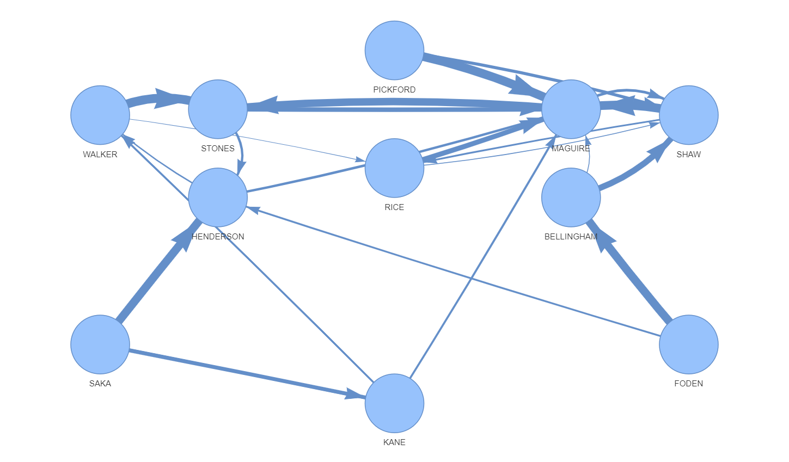
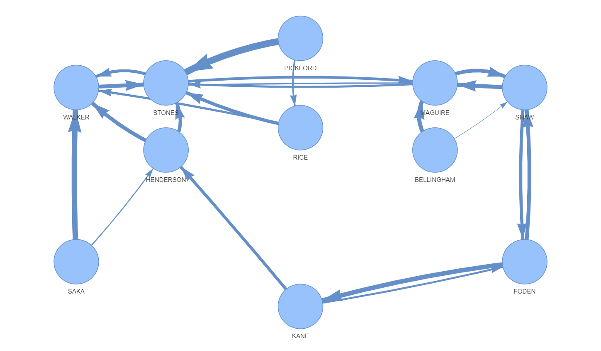

# Introduction

During the FIFA World Cup 2022 there was a resurgance for my interest in networks. While watching many of the games I often wondered who the most trusted player is with the ball and what insights one could get if the passes from player to player were recorded. My wishes came true when I found out that the tournament balls were packed full of sensors, and after painstakingly trying to find whether this data was made open source I stumbled across the match reports published in the FIFA Training Centre. 

Unfortunately, the data was published in PDF format - which is essentially where data goes to die. Although I would have liked to have analysed the passing network in every single game, the loborious task of translating it from PDF to CSV (without OCR, atleast for now) meant that I only used data from England's fixtures against Senegal and France. The data can be found in the _data/_.

# The Process 

# Results

