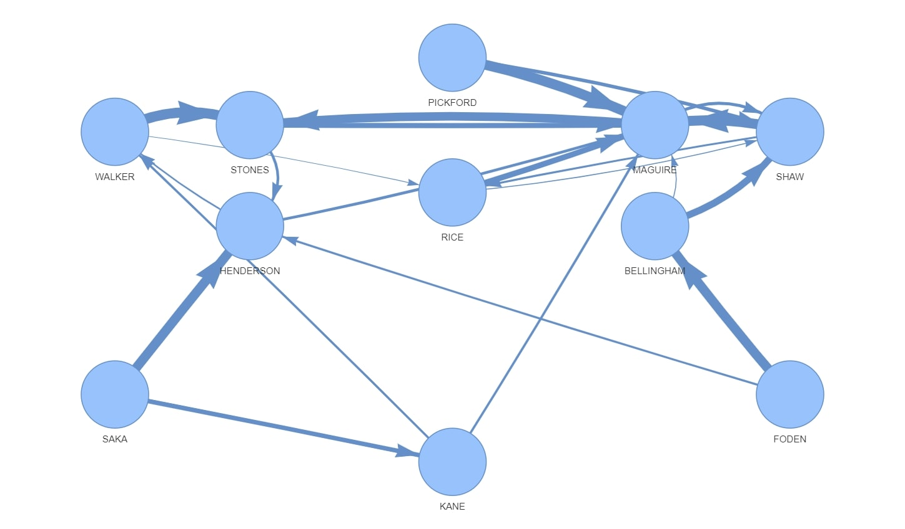
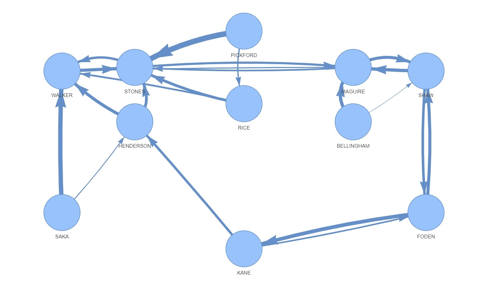

# Introduction

The Qatar 2022 World Cup came at a time when I was getting increasingly interested by networks and graphs. While watching many of the games I often wondered about 2 main questions:

* Who the most trusted player is with the ball 
* How is passing activity distributed across the pitch

Mainly, I was interested in what kind of insights one could get if passes between players were recorded. My wishes came true when I found out that the tournament balls were packed full of sensors, and after painstakingly trying to find whether this data was made open source I stumbled across the match reports published in the FIFA Training Centre. 

Unfortunately, the data was published in PDF format - which is essentially where data goes to die. Although I would have liked to have analysed the passing network in every single game, the loborious task of translating it from PDF to CSV (without OCR, atleast for now) meant that I only used data from England's fixtures against Senegal and France. The data can be found in the _data/_.

# The Process 

The raw data showed simply the number of passes that each player had made to another. I used Pandas to ingest the csv and convert the absolute numbers into percentages so they could be compared across players - at this point I was thinking of the dataframe as a transition matrix. The bulk of the technical challenge was to transform this transition matrix into an edgelist that was readable by NetworkX, a python package used for exploring graphs. The data preperation step also included other steps such as removing the first name of the players for ease of visualisation.

In the context of the questions I was interested in it was not required to map every single edge between every single player, so only the top 2 weighted edges were plotted. The visualisation was done using Pyvis. 

# Results
## Fixture against France

## Fixture against Senegal

# Insights

